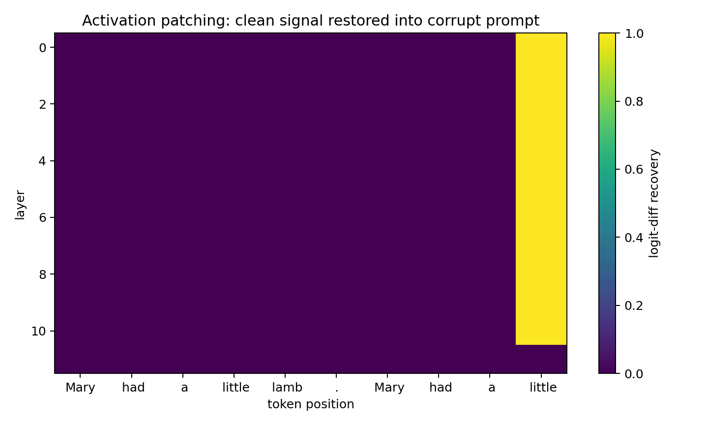
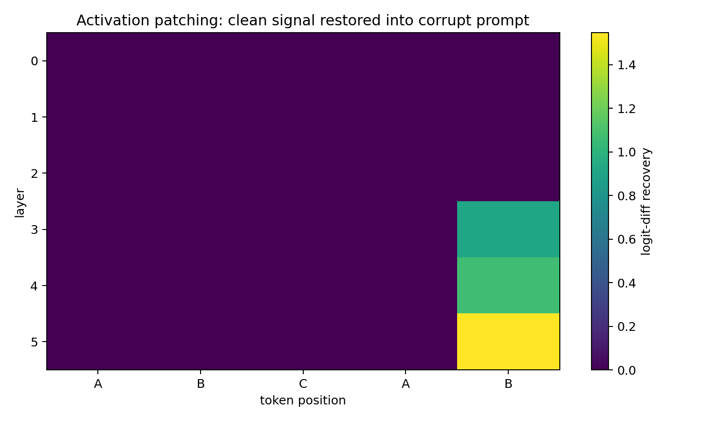
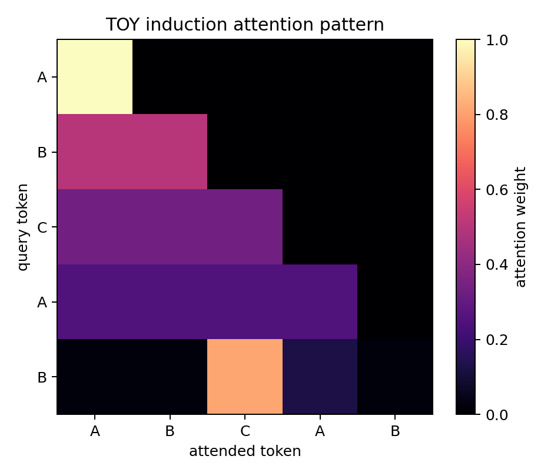
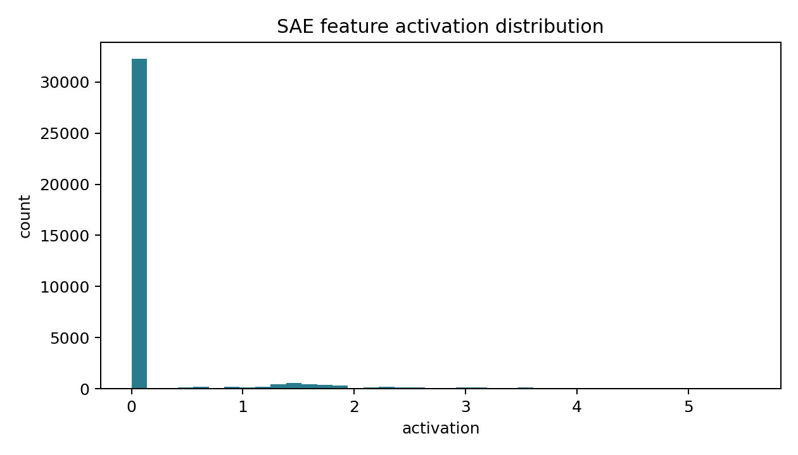
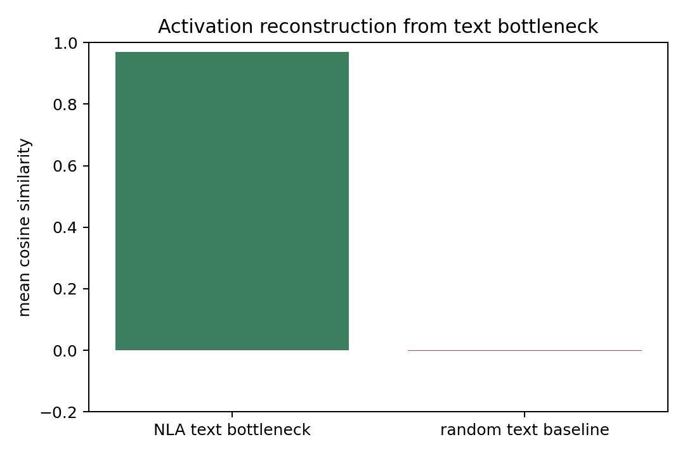

# interp-lab

`interp-lab` is a small mechanistic interpretability workbench for transformer language models. The repo includes a real GPT-2 path for activation patching and feature experiments, plus a deterministic toy backend for fast local smoke tests.

The project is organized around three resume-visible artifacts:

1. **Causal patching heatmaps** that show where clean activations restore a model behavior.
2. **Sparse autoencoder feature cards** that summarize learned activation features with top contexts.
3. **A tiny NLA-inspired text bottleneck** that verbalizes activations with constrained natural-language labels and reconstructs vectors from those labels.

The NLA module is an inspired toy replica, not a reproduction of Anthropic's RL-based Natural Language Autoencoder training setup.

## Key Result

The GPT-2 backend runs a small repeated-text prompt batch and patches residual-stream activations from clean prompts into corrupted prompts. The current checked-in run finds a residual-stream site that restores the clean target-token preference.



See the generated writeup at [`reports/gpt2/patching_case_study.md`](reports/gpt2/patching_case_study.md), with companion feature and NLA cards in [`reports/gpt2/`](reports/gpt2/).

## Quickstart: Toy Smoke Path

```bash
python3 -m pip install -e ".[dev]"
collect-activations
run-patching
train-sae
analyze-features
train-nla-toy
serve-browser --build-only
pytest
```

Open `reports/index.html` after running the commands, or launch a local browser:

```bash
serve-browser --port 8000
```

## Real GPT-2 Backend

The real-model path uses Hugging Face `AutoModelForCausalLM` hooks over a repeated-text prompt batch. It may download GPT-2 weights the first time it runs.

```bash
python3 -m pip install -e ".[models,dev]"
collect-activations --config configs/gpt2_induction.yaml
run-patching --config configs/gpt2_induction.yaml
train-sae --config configs/gpt2_induction.yaml
analyze-features --config configs/gpt2_induction.yaml
train-nla-toy --config configs/gpt2_induction.yaml
serve-browser --config configs/gpt2_induction.yaml --build-only
```

## Example Outputs

### GPT-2 activation patching


The GPT-2 heatmap shows logit-difference recovery for the strongest case in the current repeated-text prompt batch. Aggregate metrics are saved in [`reports/gpt2/patching_summary.json`](reports/gpt2/patching_summary.json).

### Toy activation patching



The toy heatmap shows the same pipeline on a deterministic backend used for CI and fast local debugging.

### Attention pattern



The toy induction head attends from the prediction position back to the earlier source token.

### SAE feature activity



SAE feature cards are generated in [`reports/sae_feature_cards.md`](reports/sae_feature_cards.md).

### Tiny NLA-inspired bottleneck



The NLA-inspired module maps an activation to constrained text labels, then reconstructs the activation from the text bottleneck. Example card: [`reports/nla_toy_card.md`](reports/nla_toy_card.md).

## CLI

| Command | Purpose |
| --- | --- |
| `collect-activations` | Cache residual-stream activations for prompt examples. |
| `run-patching` | Run clean/corrupt activation patching and render heatmaps. |
| `train-sae` | Train a sparse autoencoder on cached activations. |
| `analyze-features` | Generate feature cards and activation histograms. |
| `train-nla-toy` | Train the constrained activation-to-text-to-activation toy experiment. |
| `serve-browser` | Serve or build a static report browser. |

## Current Experiment Summary

| Artifact | What it demonstrates | Output |
| --- | --- | --- |
| GPT-2 patching heatmap | Real-model causal localization over repeated-text prompts | `reports/gpt2/assets/patching_heatmap.png` |
| GPT-2 SAE cards | Sparse features with top activating contexts | `reports/gpt2/sae_feature_cards.md` |
| GPT-2 tiny NLA card | Human-readable activation bottleneck and reconstruction metric | `reports/gpt2/nla_toy_card.md` |
| Toy smoke reports | Fully local, deterministic CI path | `reports/index.html` |

## Project Layout

```text
configs/           Reproducible experiment configs
src/interp_lab/    Package code and CLI implementations
tests/             Unit and smoke-style tests
reports/           Small checked-in figures and Markdown reports
artifacts/         Large reproducible caches/checkpoints, ignored by git
```

## Roadmap

- Add a TransformerLens backend for richer named activation sites and standard circuit-analysis utilities.
- Add richer circuit case studies with clean/corrupt prompt datasets.
- Add a browser UI for filtering SAE features by token, prompt, and activation range.
- Compare the tiny NLA bottleneck against SAE-only and nearest-neighbor label baselines.
